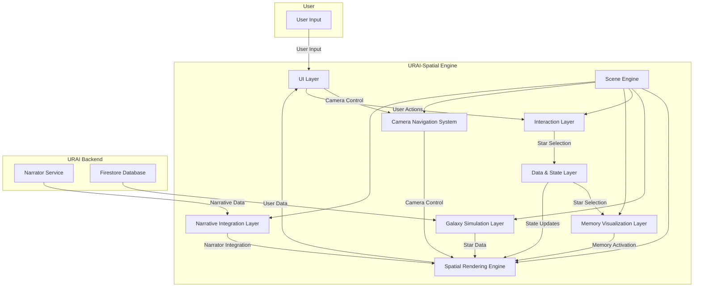

# URAI-Spatial Engine: System Architecture

## 1. System Overview

URAI-Spatial is a real-time 3D engine for visualizing user memories as a navigable galaxy. It's the core of the URAI platform's spatial interface, translating abstract data into an interactive, explorable starfield.

### Core Design Principles

- **Deterministic Rendering:** The galaxy is generated procedurally from user data, ensuring that the same data always produces the same visual output.
- **Memory-as-Stars Model:** Each star in the galaxy represents a single memory, with its properties (color, size, position) determined by the memory's metadata.
- **Cinematic Navigation:** The camera system is designed to be fluid and intuitive, allowing for seamless transitions between different views and levels of detail.
- **Passive Intelligence:** The engine passively analyzes user data to reveal patterns and insights, which are then visualized in the galaxy.

---

## 2. Tier Architecture

The engine is built on a tiered architecture, with each layer handling a specific aspect of the simulation.

### Tier 1 – Core Spatial Engine

- **Environment:** React / Next.js with React Three Fiber (R3F) for 3D rendering.
- **Scene Bootstrap:** The main `EngineSpine.tsx` component initializes the R3F Canvas and orchestrates the loading of all other systems.
- **Rendering Pipeline:** A standard R3F render loop, augmented with custom post-processing effects.
- **Deterministic Star Generation:** Star positions, colors, and sizes are calculated from memory data using a deterministic algorithm.
- **Camera System:** A flexible `CameraRig` component manages multiple camera modes and smooth transitions.
- **State Management:** Zustand is used for managing global state, including camera modes, selections, and user interactions.
- **Performance Constraints:** The engine is designed to render thousands of stars in real-time by leveraging GPU instancing and other optimizations.

### Tier 2 – Galaxy Simulation Layer

- **Star Distribution:** Algorithms generate the spiral structure of the galaxy, including the bulge, disk, and halo.
- **Density Fields:** Spiral arm density fields create realistic variations in star density.
- **Star Classification:** Stars are classified and colored based on memory metadata (e.g., emotion, type).
- **Shaders:** Custom shaders render star sprites, diffraction spikes, and glows.
- **GPU Instancing:** A single draw call is used to render all stars for maximum performance.

### Tier 3 – Environmental Layers

- **Nebula Systems:** Volumetric nebulas and fog add depth and atmosphere to the scene.
- **Parallax Layers:** Multiple layers of background stars create a sense of depth and motion.
- **Dust & Effects:** Turbulence fields, hyperspace streaks, and light cones enhance the visual experience.

### Tier 4 – Interaction Layer

- **Star Selection:** A raycasting system allows users to select individual stars.
- **Hover/Highlight:** Stars are highlighted on hover to provide visual feedback.
- **Metadata Linking:** Selected stars are linked to their corresponding memory data.
- **Memory Activation:** Clicking a star can trigger the memory visualization layer.

### Tier 5 – Memory Visualization Layer

- **Memory Sphere:** A dedicated component for rendering the contents of a selected memory.
- **Bloom and Glow:** Post-processing effects give the memory sphere a distinct, ethereal look.
- **Event Types:** The visualization can adapt to different types of memory events (e.g., photos, notes, audio).

### Tier 6 – Navigation / Camera Modes

- **Home/Sky/LifeMap Views:** Pre-defined camera positions for different perspectives on the galaxy.
- **Star Zoom & Dive:** Cinematic transitions for focusing on a single star or entering a memory sphere.
- **Replay Mode:** A mode for replaying a sequence of memories over time.

### Tier 7 – Narrative Engine Integration

- **Narrator Connection:** The engine connects to the broader URAI narrative engine to provide context and guidance.
- **Emotional Mapping:** The emotional content of memories is used to drive the visual properties of stars and other elements.
- **Timeline Playback:** The engine can visualize the chronological flow of memories along a timeline.

---

## 3. Rendering Pipeline

1.  **Initialization:** The `EngineSpine` component sets up the R3F Canvas and scene.
2.  **Star Geometry:** The `Starfield` system generates an `InstancedBufferGeometry` for all stars.
3.  **Shader Materials:** Custom `ShaderMaterial` instances are created for stars, nebulas, and other effects.
4.  **Post-Processing:** An `EffectComposer` is used to apply bloom, glow, and other post-processing effects.
5.  **Frame Updates:** On each frame, the R3F render loop updates animations, camera positions, and any dynamic elements.

---

## 4. Performance Architecture

- **GPU Instancing:** All stars are rendered in a single draw call using an `InstancedMesh`.
- **Buffer Geometry:** Star data is packed into efficient `BufferGeometry` attributes.
- **Particle Sprites:** Stars are rendered as camera-facing quads (sprites) to reduce geometric complexity.
- **Culling:** Frustum culling is handled automatically by Three.js.
- **LOD:** Not yet implemented, but planned for future expansions.

---

## 5. Data Model

- **Star Objects:** Each star is an object with properties derived from a user's memory.
- **Memory Events:** The raw data for memories, including content, timestamps, and metadata.
- **Star Metadata:** Includes position, color, size, and a reference to the original memory.
- **Emotional Color:** A mapping between emotional tags and specific colors.
- **Timeline Indexing:** Memories are indexed by time to allow for chronological playback.

---

## 6. Directory / File Architecture

- **`engine/`:** Core rendering systems, components, and logic.
- **`scene/`:** Components that define the 3D scene itself (e.g., `HomeScene`, `LifeMap`).
- **`shaders/`:** GLSL shader code for visual effects.
- **`effects/`:** Post-processing effects and other visual enhancements.
- **`background/`:** Components for rendering the deep space background.
- **`camera/`:** The `CameraRig` and related camera control logic.
- **`memory/`:** Components related to the visualization of individual memories.
- **`state/`:** Zustand stores for global state management.
- **`utils/`:** Helper functions and utilities.
- **`data/`:** Data sources and models.

---

## 7. Future Expansion Tiers

- **VR / XR Navigation:** Support for immersive navigation in VR and AR.
- **Planetary Memory Clusters:** Grouping related memories into planetary systems.
- **Constellation Storytelling:** Drawing connections between memories to form constellations.
- **AI-Driven Pattern Visualization:** Using AI to discover and visualize complex patterns in user data.
- **Temporal Galaxy Evolution:** Simulating the evolution of the galaxy over time.

---

## 8. End-to-End Flow

1.  **Open URAI:** The user opens the application.
2.  **See the Sky:** The `HomeScene` is loaded, displaying the full galaxy. The camera is in a wide, cinematic view.
3.  **Enter LifeMap:** The user navigates to the `LifeMap` view, where the camera moves to a top-down perspective.
4.  **Select a Star:** The user clicks on a star. The `InteractionController` detects the click and identifies the selected star.
5.  **Enter Memory Sphere:** The state for the selected star is updated. The camera smoothly transitions to focus on the star, and a `MemorySphere` fades in.
6.  **Exit:** The user closes the memory view. The camera transitions back to the previous view (e.g., `LifeMap`), and the `MemorySphere` fades out.

---

## 9. Visual Architecture Map

