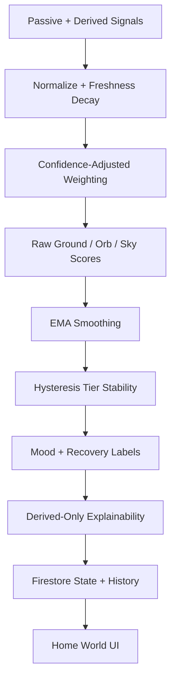

# Home World V3 Tier Stability Engine

## Purpose

Home World V3 turns passive and derived URAI signals into a stable visual world without exposing raw private media or source payloads. The engine converts signal buckets into ground, orb, and sky scores; smooths them over time; applies asymmetric hysteresis; and writes only derived state and compact explainability to Firestore.

## V2 limitations

V2 mapped a small set of direct inputs to weighted scores in one pass. It did not adjust for confidence, signal age, missing sources, disabled sources, count saturation, or previous state. It also wrote source inputs into explainability, which made the explanation document too close to raw telemetry.

## V3 derivation pipeline



## Signal normalization table

| Signal | Normalization | Half-life | Notes |
| --- | --- | ---: | --- |
| moodScore | clamp 0..100 | 12h | Current mood pattern bucket. |
| recoveryScore | clamp 0..100 | 24h | Recovery cue strength. |
| energyScore | clamp 0..100 | 12h | Orb energy rhythm. |
| recentStress | clamp 0..100, inverted when negative weighted | 12h | Softens channels when load is high. |
| sleepScore | clamp 0..100 | 24h | Backward-compatible with sleepQuality. |
| movementScore | clamp 0..100 | 12h | Backward-compatible with motionStability. |
| socialWarmthScore | clamp 0..100 | 72h | Backward-compatible with socialWarmth. |
| ritualCount | saturating countToScore(count, 4) | 168h | Count influence saturates quickly. |
| memoryCount | saturating countToScore(count, 10) | 168h | Count influence grows more gradually. |
| lifeEventIntensity | clamp 0..100 | 168h | Long-lived symbolic intensity. |
| focusScore | clamp 0..100 | 24h | Focus rhythm. |
| calmScore | clamp 0..100 | 24h | Calm cue strength. |
| shadowScore | clamp 0..100, inverted when negative weighted | 24h | Softens sky when shadow load is elevated. |

## Weights table

### Ground

| Signal | Weight |
| --- | ---: |
| recoveryScore | 0.28 |
| ritualCount | 0.18 |
| memoryCount | 0.14 |
| movementScore | 0.12 |
| sleepScore | 0.10 |
| socialWarmthScore | 0.06 |
| lifeEventIntensity | 0.05 |
| recentStress | -0.07 |

### Orb

| Signal | Weight |
| --- | ---: |
| energyScore | 0.28 |
| moodScore | 0.18 |
| recoveryScore | 0.12 |
| socialWarmthScore | 0.10 |
| focusScore | 0.10 |
| ritualCount | 0.06 |
| movementScore | 0.06 |
| recentStress | -0.10 |

### Sky

| Signal | Weight |
| --- | ---: |
| moodScore | 0.24 |
| sleepScore | 0.14 |
| recentStress | -0.18 |
| energyScore | 0.10 |
| socialWarmthScore | 0.08 |
| lifeEventIntensity | 0.12 |
| calmScore | 0.08 |
| shadowScore | -0.06 |

## EMA and hysteresis

When no previous state exists, V3 uses alpha = 1 so the first snapshot can initialize cleanly. When a previous state exists, alpha is `clamp01(0.18 + 0.22 * overallConfidence)`. This means low-confidence changes move slowly and high-confidence changes move more quickly.

Tier thresholds are `[22, 42, 66, 84]`. Upgrades require crossing the target boundary by `UP_MARGIN = 4`. Downgrades require dropping below the lower boundary by `DOWN_MARGIN = 8`. Confidence below 0.45 holds the previous tier unless the direct tier movement is extreme.

## Firestore schema

State lives at:

```text
users/{userId}/homeWorld/state
```

Latest explanation lives at:

```text
users/{userId}/homeWorldExplainability/latest
```

Optional explanation history lives at:

```text
users/{userId}/homeWorldExplainability/latest/history/{eventId}
```

The state document stores derived V3 fields: tiers, mood/recovery labels, intensities, raw score snapshots, smoothed score snapshots, confidence snapshots, source coverage, and timestamps.

The explainability documents store compact explanation fields only: headline, summary, why-am-I-seeing-this copy, channel summaries, confidence reasons, source coverage summary, contributor buckets, and privacy flags.

## Privacy and redaction policy

Home World explainability must never persist raw HomeWorldSignals, raw audio, raw text, contact names, raw lat/lng, message bodies, or full source payloads. Explainability stores contributor summaries and buckets only.

Required privacy flags:

```ts
rawSignalsStored: false
usedRawAudio: false
usedContactIdentity: false
```

Required user-facing language:

- Your world responds to derived patterns, not raw private media.
- Recent signals carry more weight than older ones.

## Tests

V3 includes unit tests for derivation structure and explainability guardrails, plus a Playwright smoke spec for:

- tier selectors on the home route
- the explanation button and panel
- derived/privacy language
- absence of raw signal JSON
- LifeMap navigation

## Migration

Existing V2 state reads remain compatible. `fromFirestoreState` accepts missing V3 fields and fills sparse defaults for scores, confidence, coverage, and timestamps. Existing `fetchHomeWorldState`, `saveHomeWorldState`, and `deriveAndSaveHomeWorldState` exports remain available as wrappers.

## Open questions

- Whether history snapshots should be rate-limited beyond the meaningful-change gate.
- Whether confidence bands should be exposed to users as labels only or with percentages.
- Whether source coverage should eventually be separated by collection/source family instead of signal key.
- Whether sparse fallback should vary by user onboarding age once onboarding metadata is available.
